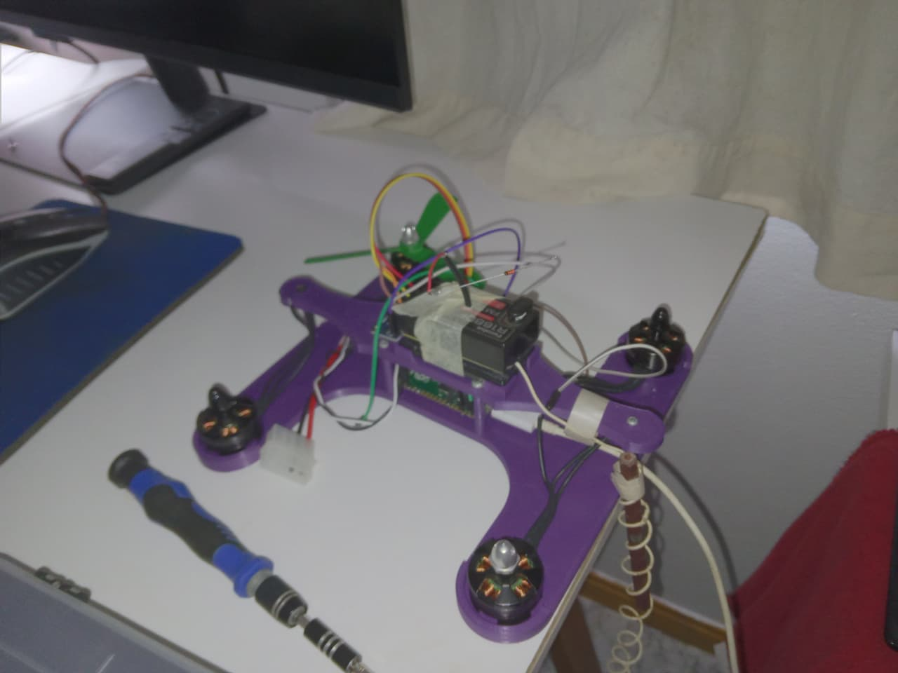
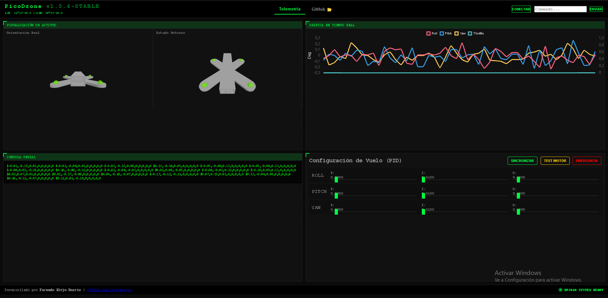

# 🛸 RP2040 Custom Flight Controller (PicoDrone)


Proyecto de **Controladora de Vuelo (FC)** desarrollada desde cero para el microcontrolador **RP2040**. Este firmware aprovecha las capacidades de hardware de la Raspberry Pi Pico (específicamente los bloques PIO) para gestionar protocolos de baja latencia.


configurador personalizado [configurator_link](https://lloysmaster.github.io/)
repositorio [repo_link](https://github.com/lloysmaster/lloysmaster.github.io)



---

## 🛠️ Especificaciones Técnicas

| Componente | Detalle | Protocolo/Conexión |
| :--- | :--- | :--- |
| **MCU** | Raspberry Pi Pico (RP2040) | Dual Core @ 125MHz |
| **IMU** | MPU6500 | **SPI** (Alta Velocidad) |
| **ESC** | BLHeli_S 20A | **DShot300** via PIO |
| **Radio RX** | Futaba 75MHz (Vintage) | **PPM** via PIO |
| **Motores** | Brushless 2204 | Configuración en "X" |

---

## 🚀 Estado del Desarrollo

Actualmente el sistema procesa la señal de radio y estabiliza los motores en un loop de **500Hz**.

- [x] **Lectura de Sensores:** Comunicación SPI estable con el MPU6500.
- [x] **Decodificador PPM:** Implementado en PIO para no cargar la CPU.
- [x] **Driver DShot:** Generación de tramas digitales para ESCs modernos.
- [y] **PID Control:** Estructura base funcional (en proceso de ajuste de constantes).
- [ ] **Seguridad:** Implementación de Failsafe y armado de motores.

### Diagrama de Motores (Configuración X)
```text
    M2 (FL) CW      M4 (FR) CCW
         \          /
          \  PICO  /
          /   FC   \
         /          \
    M1 (BL) CCW     M3 (BR) CW
```

---

## 🤝 Colaboración y Feedback

¡Hola! Este es un proyecto de aprendizaje y experimentación personal. No busco colaboradores activos, pero **estoy muy abierto a cualquier sugerencia, corrección o mejora** que quieras aportar al código.

Si tienes experiencia en estas áreas, tu feedback sería de gran ayuda:
* **Filtros:** Implementación de filtros (complementario o Kalman) para el ruido del giroscopio.
* **Control:** Sugerencias para el tuneo de las constantes PID.
* **PIO:** Optimizaciones en el uso de los State Machines del RP2040.

> [!IMPORTANT]
> **Seguridad:** Si decides clonar o probar este firmware, asegúrate de retirar las hélices de los motores por seguridad.

---

## 📂 Compilación y Uso

Este proyecto requiere el **Raspberry Pi Pico SDK** configurado en tu sistema.

1. Clona el repositorio.
2. Crea una carpeta llamada `build`.
3. Desde la terminal, dentro de `build`, ejecuta:
   ```bash
   cmake ..
   make
4. en la carpeta build encontraras un archivo .uf2 carga el archivo generado en tu Raspberry Pi Pico.

desde la interfaz de visual studio se hace todo mucho mas sencillo, directamente encotras botones como "compile" y "run" que cumplen de paso 2,3 y 4 respectivamente, si estas en linux quiza el 4 paso lo tengas que hacer manualmente

pequeño detalle, uso el sdk de pi pico desde la extencion de visual studio

